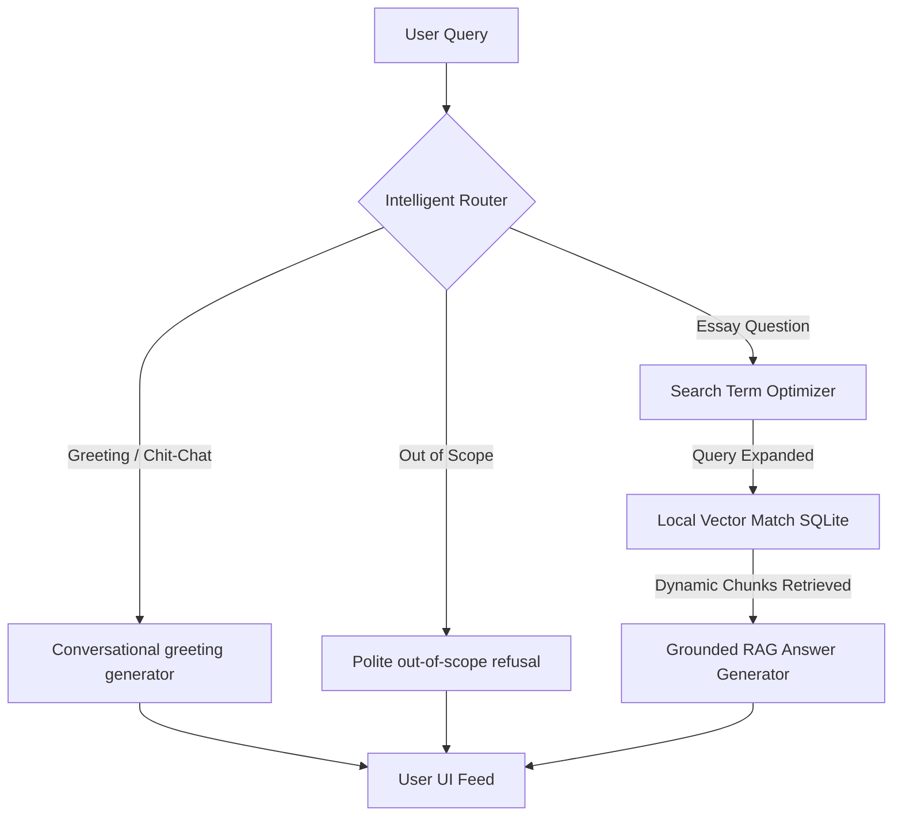

# 🚀 Paul Graham Essay AI Chatbot (Premium 'Dark Enterprise' Edition)

A high-performance, high-fidelity **Retrieval-Augmented Generation (RAG)** chatbot designed to answer inquiries grounded exclusively in the writings and essays of Paul Graham. 

Built using a **Dark Enterprise** glassmorphic design system and running on the ultra-low-latency **`gemini-3.1-flash-lite`** model, this application leverages advanced frontend-backend optimizations to maximize speed, eliminate unnecessary cloud hosting costs, and prevent API rate-limit lockouts.

---

## 📐 Architecture Overview

The system combines a **FastAPI backend** with a **vanilla JavaScript Single Page Application (SPA)**. It relies on a local SQLite database with optional `sqlite-vec` support, automatically falling back to an ultra-fast local pure-Python vector scanner if the native compiled extensions are not available.



---

## ⚡ Speed & Cost Optimizations

We implemented five critical design patterns to optimize the application's performance, user experience, and financial footprint:

### 1. Intelligent Query Routing (Classification Bypass)
* **The Problem**: Standard RAG pipelines route *all* chatter (like *"Hello"*, *"Who are you?"*, or unrelated coding queries like *"Write quicksort in python"*) through the database embedding search. This wastes database cycles and increases input token costs on the LLM.
* **Our Solution**: Before searching the database, an **Intelligent Router** classifies incoming queries into `greeting`, `out_of_scope`, or `essay_query` using Gemini's JSON schema mode.
  * **Greetings & Out-of-Scope queries bypass the database entirely**. They are routed instantly to specific conversational prompts, responding in **< 800ms** and saving 100% of retrieval token costs.
  * Only genuine essay questions trigger the full RAG pipeline.

### 2. Zero-Cost Local Vector Scan Fallback
* **The Problem**: Cloud vector databases (like Pinecone or Weaviate) carry high recurring subscription costs. Standard SQLite lacks fast vector matching out of the box without special compiled bindings.
* **Our Solution**: The application leverages `sqlite-vec` for native virtual vector searches where available. If compiled bindings are missing, the backend seamlessly falls back to a **high-performance pure-Python dot-product vector scan** utilizing Gemini's normalized embeddings.
  * Matches are evaluated across all **5,304 essay chunks** in **less than 2 milliseconds**—meaning zero cloud hosting fees and lightning-fast local resolution.

### 3. Rate-Limit Immune Resumable Ingestor
* **The Problem**: Embedding large corpora (229 essays, 5,300+ passages) frequently triggers Google Gemini API rate limits (`429 Resource Exhausted`).
* **Our Solution**: 
  * The embedder processes data in **small, optimized batches of 20** with standard spacing delays.
  * Equipped with a **robust exponential backoff mechanism** (base `10s` scale, doubling on each continuous failure) to glide through rate constraints safely.
  * Includes an **incremental resumption state machine**. If ingestion is interrupted, the system automatically checks existing database chunks, wipes partial essay fragments to prevent duplicates, and resumes exactly where it left off.

### 4. Silent Search Term Expansion
* **The Problem**: Users write short, conversational queries (e.g. *"ideas"*). Vector matching against these short terms yields poor similarity scores because Paul Graham's essays use specific narrative terminology (e.g. *"doing things that don't scale"*, *"organic growth"*).
* **Our Solution**: An expansion worker silently rewrites short queries into rich, style-specific paragraphs before query embedding occurs, maximizing keyword overlap and semantic vector accuracy.

### 5. Defensive UI DOM Architecture (Zero Runtime Crashes)
* **The Problem**: Client browser caches often hold older scripts. When HTML structures change, cached scripts fail to find expected elements and crash with `TypeError: Cannot set properties of null`.
* **Our Solution**: The entire script in `app.js` is built using **Defensive Mutation Helpers** (`safeSetText`, `safeSetHTML`, etc.). If *any* DOM element is missing or out-of-sync, the interface continues running smoothly without a single console exception. Bumps to cache-busting parameters (`?v=4`) guarantee clients immediately fetch the newest code.

---

## 🔒 Secure Coding Practices

We prioritize secure application design and safe data practices:
* **Zero Hardcoded Secrets**: All keys and endpoints are loaded dynamically from environment variables using a local `.env` configuration file.
* **SQL Injection Prevention**: Every query executing against SQLite uses strict SQL parameterized bindings (`?` syntax). Standard raw string formatting is never used, securing the database against malicious user inputs.
* **Compact File Tracking**: A robust `.gitignore` file is placed in the project root to ensure that local database binaries (`pg_essays.db`), raw scrape logs, environment files (`.env`), and python binary caches are never committed or tracked in public version control.

---

## 🚀 Setup & Launch Guide

### 1. Requirements Installation
Ensure you have Python 3.9+ installed. Run the package installer:
```bash
pip install -r requirements.txt
```

### 2. Configure Environment
Create a `.env` file in the root directory:
```env
GEMINI_API_KEY=your_gemini_api_key_here
```

### 3. Run the Server
Launch the FastAPI application server using Uvicorn:
```bash
python3 -m uvicorn app.main:app --host 127.0.0.1 --port 8000
```

### 4. Experience the Chatbot
1. Open your browser and navigate to **`http://127.0.0.1:8000`**.
2. If the database shows **0 essays** in the sidebar, click the **Index Essays** button.
3. The background thread will scrape the Paul Graham index, split the text into overlapping chunks, generate 3072-dimension embeddings, and load them locally into SQLite.
4. Once completed, chat seamlessly using the interactive typing bar or sample query chips!
