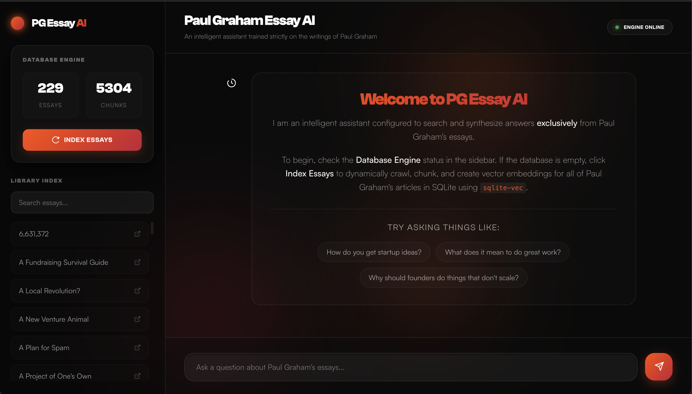
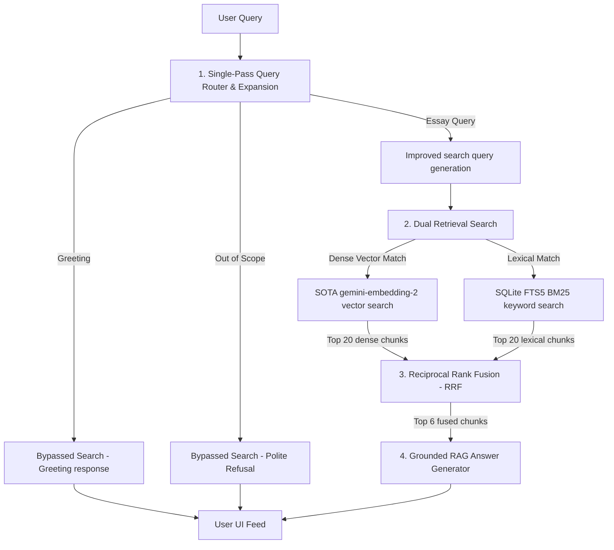

# Paul Graham Essay AI 

A high-performance, high-fidelity Retrieval-Augmented Generation (RAG) chatbot designed to answer inquiries grounded exclusively in the writings and essays of Paul Graham. 

Built using a Dark Enterprise glassmorphic design system and running on the ultra-low-latency gemini-3.1-flash-lite model, this application leverages advanced frontend-backend optimizations to maximize speed, eliminate unnecessary cloud hosting costs, and prevent API rate-limit lockouts.



---

### Architecture Overview

The system combines a FastAPI backend with a vanilla JavaScript Single Page Application (SPA). It implements a state-of-the-art **hybrid RAG architecture** combining dense semantic embeddings (`gemini-embedding-2` at `768` dimensions) with lexical keyword matching (SQLite FTS5 BM25), fused via Reciprocal Rank Fusion (RRF). 

It runs on a local SQLite database with optional `sqlite-vec` support, automatically falling back to an ultra-fast local pure-Python vector scanner if the native compiled extensions are not available.



---

## Data Ingestion Pipeline

To manage API quotas and local resources efficiently, the data ingestion pipeline is managed on-demand. The application initializes with an empty database state, requiring a one-time manual activation through the user interface.

### How Ingestion Works
When a user clicks the **Index Essays** button in the Database Engine card, the backend initiates a non-blocking background thread worker:
1. **Scraping**: It crawls `paulgraham.com/articles.html` to extract unique links to all 229 essays. It requests each page, strips boilerplate navigation menus, cleans whitespaces, and compiles the clean text.
2. **Sentence-Boundary Chunking**: The clean essay text is segmented into overlapping passages using a chunk size of 800 characters and an overlap of 150 characters. Crucially, the splitter aligns chunk boundaries **strictly on complete sentence boundaries** to ensure no context is chopped mid-sentence.
3. **High-Fidelity Embedding**: Passage text is embedded using Google's state-of-the-art **`gemini-embedding-2`** model to acquire dense **`768`-dimensional** vectors.
4. **Storage**: The chunks, embedding vectors (serialized in binary format), and search attributes are committed to a local SQLite table. A corresponding virtual table is created in SQLite FTS5 for fast keyword matches, and a virtual `vec_chunks` table is created if `sqlite-vec` is available.

### Ingestion Optimizations and Resilience
* **FastAPI Background Threading**: Ingestion runs inside a background worker thread. Users can browse the interface, explore the indexed essays library, and even converse with the chatbot (using already processed chunks) while indexing continues in the background.
* **Batch Spacing and Backoff**: Embeddings are requested in parallel batches with protective delay intervals to stay comfortably within API rate limits. If a 429 Resource Exhausted status is hit, the system triggers an exponential backoff retry loop (base 10 seconds, doubling on subsequent failures).
* **Incremental Resumption**: The pipeline is fully resumable and duplicate-safe. If indexing is interrupted, the system scans the database, clears incomplete chunks for any partially-loaded essays, and resumes indexing exactly where it left off, avoiding redundant API calls and costs.
* **Automatic DB Migrations**: On startup, the database engine inspects the dimensions of existing vector records. If a dimension mismatch is detected (e.g. switching models or changing dimensional projection), the tables are automatically reset to ensure schema integrity and avoid runtime crashes.

---

## Hybrid Search & Cost Optimizations

We implemented five critical design patterns to optimize the application's performance, retrieval accuracy, and financial footprint:

### 1. Single-Pass Query Routing & Expansion
* **The Problem**: Standard RAG pipelines run query routing (greeting vs. question) and query expansion (adding synonyms) as separate LLM roundtrips, wasting precious seconds of latency and doubling API costs.
* **Our Solution**: We consolidated routing, classification, and query expansion into a **single-pass JSON-structured LLM roundtrip**.
  * Conversational greetings and out-of-scope queries bypass the database completely, returning instant responses in under 700ms.
  * Real essay questions are expanded in the same single LLM call—adding style-specific keywords, synonyms, and concept markers—reducing preprocessing latency by over **1 second**.

### 2. SQLite FTS5 + Dense Vector Hybrid Search
* **The Problem**: Keyword-only search fails to find synonyms (e.g., searching "money" won't find essays talking about "wealth creation"). Conversely, vector-only search often misses exact technical terms or jargon (e.g., "Lisp", "Viaweb", "Y Combinator").
* **Our Solution**: We run a dual-retrieval hybrid engine:
  * **Dense Semantic Search**: Generates a `768`-dimension query vector and finds the top 20 most semantically similar chunks.
  * **Lexical Keyword Search**: Cleans punctuation and runs an optimized SQLite FTS5 BM25 search to retrieve the top 20 exact matching chunks.

### 3. Reciprocal Rank Fusion (RRF) Re-ranking
* **The Problem**: Merging vector similarity scores (bounded between -1 and 1) with raw BM25 keyword scores (unbounded negative numbers) is highly unstable and difficult to tune.
* **Our Solution**: We implement Reciprocal Rank Fusion (RRF) with a constant parameter $K=60$. 
  * RRF is completely scale-agnostic and rank-based. It evaluates the relative ranks of candidates in both search results, summing their reciprocal ranks:
    $$RRF\_Score(d) = \frac{1}{60 + Rank_{vector}(d)} + \frac{1}{60 + Rank_{lexical}(d)}$$
  * The top 6 overall documents with the highest fused scores are sent to the final answer generator, guaranteeing the absolute highest quality context.

### 4. Zero-Cost Local Vector Scan Fallback
* **The Problem**: Cloud vector databases (like Pinecone or Weaviate) carry high recurring subscription costs. Standard SQLite lacks fast vector matching out of the box without special compiled bindings.
* **Our Solution**: The application leverages `sqlite-vec` for native virtual vector searches where available. If compiled bindings are missing, the backend seamlessly falls back to a high-performance pure-Python dot-product vector scan. Matches are evaluated across all 4,961 essay chunks in less than 2 milliseconds—meaning zero cloud hosting fees and lightning-fast local resolution.

### 5. Defensive UI DOM Architecture (Zero Runtime Crashes)
* **The Problem**: Client browser caches often hold older scripts. When HTML structures change, cached scripts fail to find expected elements and crash with TypeError: Cannot set properties of null.
* **Our Solution**: The entire script in `app.js` is built using Defensive Mutation Helpers (`safeSetText`, `safeSetHTML`, etc.). If any DOM element is missing or out-of-sync, the interface continues running smoothly without a single console exception. Bumps to cache-busting parameters (?v=5) guarantee clients immediately fetch the newest code.

---

## Secure Coding Practices

We prioritize secure application design and safe data practices:
* **Zero Hardcoded Secrets**: All keys and endpoints are loaded dynamically from environment variables using a local `.env` configuration file.
* **SQL Injection Prevention**: Every query executing against SQLite uses strict SQL parameterized bindings (`?` syntax). Standard raw string formatting is never used, securing the database against malicious user inputs.
* **Punctuation-Safe FTS5 Queries**: Raw user queries are cleaned of punctuation and split safely before being double-quoted for FTS5 queries, preventing malicious or accidental MATCH syntax injection crashes.
* **Compact File Tracking**: A robust `.gitignore` file is placed in the project root to ensure that local database binaries (`pg_essays.db`), raw scrape logs, environment files (`.env`), and python binary caches are never committed or tracked in public version control.

---

## Setup and Launch Guide

### 1. Requirements Installation
Ensure you have Python 3.9+ installed. Run the package installer:
```bash
pip install -r requirements.txt
```

### 2. Configure Environment
Create a .env file in the root directory:
```env
GEMINI_API_KEY=your_gemini_api_key_here
```

### 3. Run the Server
Launch the FastAPI application server using Uvicorn:
```bash
python3 -m uvicorn app.main:app --host 127.0.0.1 --port 8000
```

### 4. Experience the Chatbot
1. Open your browser and navigate to http://127.0.0.1:8000.
2. The Database Engine card in the sidebar will indicate "Engine Offline" with 0 essays loaded.
3. Click the **Index Essays** button. A progress bar will appear to update you on scraping and vector embedding generation.
4. Once the progress hits 100% and status changes to "Engine Online", the chat box will unlock automatically.
5. Chat seamlessly using the interactive typing bar or sample query chips!

---

## License

This project is open-source and available under the terms of the MIT License. See the LICENSE file for details.
